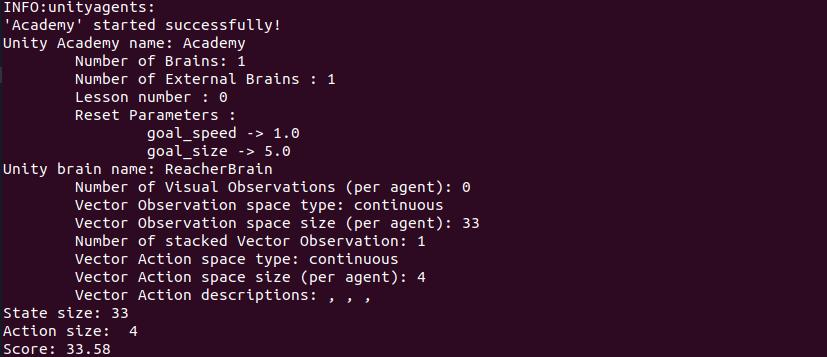

# Reinforcement Learning: Continuous Control
## Code
There are four python files in the project repo:
* `model.py`: contains the code specifying the backbone neural network structure.

* `ddpg_agent.py`: contains the core code of DDPG algorithm

* `train.py`: contains the code for training the agent. To launch the code, use 

            python train.py

* `test.py`: contains the code to test the trained agent.

            python test.py

## Data
There are two `.data` files in the repo:
* `checkpoint_actor.data`: the trained Actor network
* `checkpoint_critic.data`: the trained Critic network

## Learning Algorithm
### Network Structure
There are two feedforward neural networks, one for the Actor, one for the Critic.
* **Actor network**: Given an input state, the Actor network outputs the correponding 4-dimensioal action vector.
    * **Input layer**: The input to the neural network is the current state in the continuous control environment, which is a 33 dimensional vector.
    * **Hidden layers**: There are two hidden layers. Both have 256 neurons.
    * **Output layer**:   The output is the action parameter, which is a four dimentional vector.

* **Critic network**:  Given an input state and a action vector, the Critic network estimates the value of applying the input action to the input state.
    * **Input layer**: The input to the neural network is the current state in the continuous control environment, which is a 33 dimensional vector.
    * **Hidden layers**: There are two hidden layers. Both have 256 neurons. The input to the 2nd hidden layer is the output of the 1st hidden layer concatednated with the input action vector, namely a 256 + 4 = 260 dimentional vector.
    * **Output layer**:   The output is a number, indicating the value (score) of applying the input action to the input state.

### Training Algorithm
There are severl components in the training algorithm.

1. **Replay Buffer**. This is a `deque` buffer recording the playing experiences. Each record is a **experience tuple** `(S, A, R, S', done)` consisting of `state`, `action`, `reward`, `next_state` and `done` of the environment. The agent plays according to current agent's parameters. After every certain steps, a batch of experience tuples are randomly sampled from the replay buffer, which are then used to update the agent parameters. 

2. **TD Learning for Critic**. The TD learning algorithm is used to update the Critic network. Namely, we hope for each experience tuple `(S, A, R, S', done)`, the Q score `Q(S, A)` can be closed to the following TD-target
    
        TD-target = R + GAMMA * Q(S', Actor(S')) * (1-done) 
    where `GAMMA` is the discount parameter. And `Actor(S')` is the output of Actor netrowk, which estimates the action corresponding to the `S'` state. Comparing with Q-learning, here we use `Actor(S')` to get the next action, instead of using the Critic network itself.

3. **Maximizing the value of the Actor output**. The Actor network directly estimates the action vector given an input space, whose value can be estimated by the Critic network. Therefore we train the Actor network such that the value of its output is as big as possible. Namely, the Actor network should give high value actions.

## Hyperparameters
A few hyperparameters are used in the training process. They are listed as follows:

* `BUFF_SIZE = 100000`, the size of the replay buffer.
* `BATCH_SIZE = 128`, the batch size in stochastic gradien descent.
* `LR_ACTOR = 1e-4`,        learning rate of the actor.
* `LR_CRITIC = 1e-4`,       learning rate of the critic.
* `GAMMA = 0.99`, the discount factor for computing accumulated gains.
* `TAU = 1e-3`, this is used in `soft_update` to update the target parameters.
* `UPDATE_EVERY = 20`,      model is updated every UPDATE_EVERY time steps.
* `N_UPDATES = 10`,         number of updates in every `UPDATE_EVERY` time steps.
* `sigma`, controls the noise added to the action for exploration:
    * `sigma_start = 0.2`, the initial value of sigma.
    * `sigma_end = 0.01`, the minial value of sigma.
    * `sigma_decay = 0.995`, the decaying factor of sigma after each episode.

## Experiment Tunning
* First as suggested, I added graident clip, `UPDATE_EVERY` and `N_UPDATES` parameters. 
* Then I tunned the number of hidden neurons, learning rate. I found durinig the training, the average score could first increase but stopped increasing around value of 20.
* Then I changed the `relu` function in the neural networks to `leaky_relu`. The score can increase to about 27 after 1000 episodes.
* Finally I changed the `sigma` parameter, which controls the noise added to the action for exloration. Instead of fixing it at the default value `0.2`, I made it start from `0.2`, then gradually decay after each episode. To keep exploration, I set `sigma_end` at `0.01`, which the lower bound of `sigma`. The average score exceeded 30 after 487 episodes. 

## Results
### Training
To launch the training code, please run 

    python train.py

Here is plot of the reward in each episode

As can be seen from the recores, the environment can be solved at before the 400-th episode.

### Test
To play with trained agent, please run:

    python test.py

It can be seen that with the trained agent, a score of 33.58 has been obtained during the test run.

## Future Works
I have worked with the first version of the environment, which contains one signle agent. In the future I would try the 2nd verion, which has 20 identical agents.

I have obervered using `leaky_relu` is helpful in the project. Other approaches like `batch normalizaion` can also be experimented to see whether they are helpful as well.

